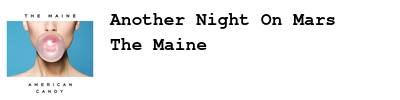

# spoofybadge

A simple python script that uses the Spotify API to generate a bitmap from "currently-playing" data.

The idea is that you can customize the ImageMagick parameters, and create an electronic badge, say on a [eink Display Hat](https://www.adafruit.com/product/3934)

---

